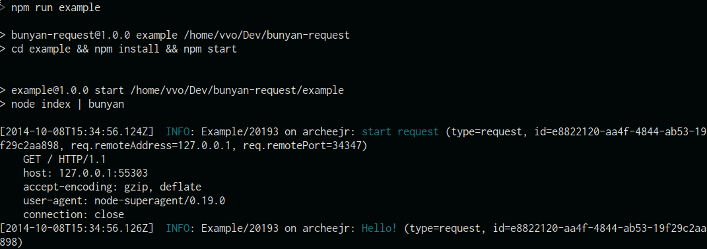

# bunyan-request [](https://david-dm.org/vvo/bunyan-request) [](https://david-dm.org/vvo/bunyan-request#info=devDependencies)

Request, response logger middleware using [bunyan](https://github.com/trentm/node-bunyan):
- log request as `req`
- log response as `res`
- log request<>response duration in milliseconds as `duration`
- creates, use and forward to response the `x-request-id` request header: get it if present, create it otherwise
- provides `req.log` as an id-specialized logger for you to track your request in your entire application
- compatible with pure [http server](http://nodejs.org/api/http.html#http_http_createserver_requestlistener), [express](https://github.com/strongloop/express), [connect](https://github.com/senchalabs/connect) and any http middleware system



## Install

```shell
npm install bunyan-request --save
```

## Usage

```js
var bunyan = require('bunyan');
var bunyanRequest = require('bunyan-request');
var express = require('express');

var app = express();
var logger = bunyan.createLogger({name: 'My App'});
var requestLogger = bunyanRequest({
  logger: logger,
  headerName: 'x-request-id'
});

app.get('/', function(req, res) {
  // now use `req.log` as your request-specialized bunyan logger
  req.log.info('YO DAWG!');
  res.send('ok');
});
```

## `x-request-id`

Will use and forward `x-request-id` (case insensitive) header when present.

Otherwise it will generate
a [uuid.v4()](https://github.com/defunctzombie/node-uuid#uuidv4options--buffer--offset) and
add it to the response headers.

## Example

```shell
npm run example
```

See [example](example).

## Test

```shell
npm test
```

## Credits

First version by [tellnes/bunyan-middleware](https://github.com/tellnes/bunyan-middleware).

## License

MIT
